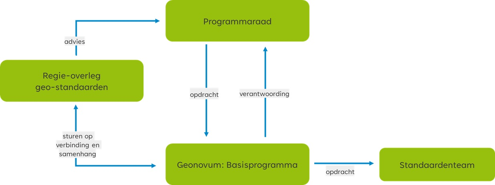

# Gebruik van het wijzigingsprotocol {#41513FF0}
Het wijzigingsprotocol schrijft een vast stramien voor het wijzigen van de standaard voor. Het protocol benoemt de fasen en de op te leveren resultaten. Belangrijk zijn de randvoorwaarden en uitgangspunten. De gebruikers en ketenpartners van de geo-standaarden worden bij het wijzigen van de standaard nauw betrokken. 
## Protocol versus proces {#7CDE8796}
De titel van dit document geeft aan dat het hier om een protocol gaat. Toch wordt in dit document ook gesproken over processen. Een wijzigingsprotocol beschrijft de manier waarop wijzigingen in de basisset geo-standaarden plaatsvinden: het wijzigingsproces. In het protocol zijn basisbegrippen en uitgangspunten uiteengezet voor het wijzigingsproces, bijvoorbeeld wat onder nieuwe en volgende versies verstaan wordt en wanneer deze verwacht mogen worden. De daadwerkelijke planning van een nieuwe versie is op hoofdlijnen uitgewerkt in de standaardenagenda, en meer in detail in de tijdens de kwartaalplanning uitwerkt. Deze standaardenagenda zal nog worden vertaald naar een roadmap, waarin voor de komende jaren de verdere ontwikkeling en de uitfasering van de (verschillende versies van de) standaarden wordt getoond.
 
 
Met behulp van een wijzigingsprotocol voor de basisset geo-standaarden geeft Geonovum:
<ul><li>inzicht in het behandel- en besluitproces dat ten grondslag ligt aan het versiebeheer;</li>
<li>inzicht in de aangeboden wijzigingsvoorstellen;</li>
<li>stabiliteit aan de standaard;</li>
<li>continuïteit aan de standaard;</li>
<li>een eenduidige aanpak.</li>
</ul>
 
 
De stabiliteit en continuïteit van de standaard maken wij inzichtelijk met het jaarplan voor standaardisatie en innovatie. Hierin staan de activiteiten die wij uitvoeren om de interoperabiliteit binnen onze nationale geodata infrastructuur (NGII) te borgen en welke innovaties wij in dit kader verkennen.
## Releasebeleid {#000486F9}
Een release van een standaard is een nieuwe uitgave van de standaard. De nieuwe release kenmerkt zich ten opzichte van de oude versie door een hoger versienummer. Een release betreft 1 product van een standaard of is een bundel van meerdere producten van de betreffende standaard. Bij de release is ieder product is voorzien een nieuw versienummer conform X.Y.Z schrijfwijze (zie paragraaf 2.2.1) en een status. Een voorbeeld van een bundel is de nieuwe uitgave van een informatiemodel, een schema (bijvoorbeeld .xsd of .json), een schematron (.sch) en een praktijkrichtlijn. 
 
 
We werken aan een nieuwe uitgave van een product van de standaard op GitHub. Bij een release wordt de nieuwe versie van het product/ de bundel van producten opgeleverd en gepubliceerd van GitHub naar een van de volgende Geonovum publicatieservers. Welke publicatieserver is afhankelijk van het type product.  
<ul><li><a href='http://register.geostandaarden.nl/' target='_blank'>Technisch register</a></li>
<li><a href='https://definities.geostandaarden.nl/' target='_blank'>Conceptenbibliotheek</a></li>
<li><a href='https://docs.geostandaarden.nl/' target='_blank'>Documenten register</a></li>
<li><a href='https://modellen.geostandaarden.nl/' target='_blank'>Ontologieën register</a></li>
</ul>
 
 
Ontsluiting breed naar ons netwerk vindt vervolgens altijd plaats via de Geonovum website op de geo-standaarden pagina en nieuwsbrieven. Op de Geonovum website verwijzen voor het raadplegen en downloaden van de nieuwe uitgave altijd naar de bronlocatie: onze publicatieservers. 
### Nieuwe versie van de standaard {#48BAAD23}
Elk product van onze standaarden is altijd voorzien van een versienummer. Bij het aanpassen van dat product, wijzigt het versienummer. De grootte van de wijzigingen (major, minor, patch ofwel X,Y,Z wijzigingen) heeft gevolg voor de implementatie van de standaard en wordt uitgedrukt in de  versienummering. Hierbij wordt de ‘Semantic Versioning’ (<a href='https://semver.org/lang/nl/' target='_blank'>SemVer</a>) methodiek aangehouden.
 
 
We hanteren drie typen versies voor een wijziging van een standaard. Bijvoorbeeld: versie 2.1.0 (=X.Y.Z):
<ul><li><b>X-wijzigingen </b>Dit zijn grote (major) wijzigingen van de standaard die niet backwards compatible zijn. </li>
<li><b>Y-wijzigingen </b>Dit zijn wijzigingen die wel backwards compatible zijn.   </li>
<li><b>Z-wijzigingen </b>Dit zijn in feite oplossingen van technische fouten of verbeteringen van technische aard, alsmede tekstuele verbeteringen. Deze wijzigingen zijn backwards compatible.</li>
</ul>
### Consultatie  {#4AD37261}
Met (door)ontwikkelen van een standaard leveren wij nieuwe versies van de producten van de standaard op. Doel van een consultatie is ons netwerk, de gebruikers van de standaard en de ketenpartners te raadplegen; wij vragen hen om advies, zodat de standaard zo goed mogelijk aansluit om de werkprocessen van de eindgebruikers van de standaarden. 
De consultaties zijn openbaar/ publiek en daardoor mag iedereen reageren op de nieuwe versie. Consultaties duren minimaal 3 weken en maximaal 8 weken. Bekendmaking gebeurd via de Geonovum website door middel van een nieuwsbericht. We attenderen de gebruikers en de ketenpartners via onze nieuwsbrief de Geo-standaard (inschrijving daarvoor vindt plaats via de Geonovum website). 
Wanneer en hoe lang een consultatie plaatst vindt, is afhankelijk van proces varianten bij wijzigingen (zie paragraaf 2.3).
### Oudere versie van een standaard {#3C90F7C6}
De SemVer-methodiek schrijft backwards compatibility voor op het Y-niveau. Na het uitbrengen van een nieuwe versie van een bij Geonovum in beheer zijnde standaard blijven oudere versies beschikbaar en zijn vindbaar via de Geonovum website. Een nieuwe versie dwingt daarmee geen directe overstap af bij de gebruikers, tenzij anders (bijvoorbeeld wettelijk) bepaald. Na het uitbrengen van de nieuwe versie van een standaard wordt de ontwikkeling van de oude versie stop gezet.
 
 
Voor het onderhoud en de ondersteuning van een oude versie van een standaard gelden de volgende uitgangspunten:
<ul><li>Aan een oude versie worden geen nieuwe features toegevoegd, geen aanpassingen gedaan op X en Y niveau na het uitbrengen van een nieuwe versie. Verzoeken om aanpassing en wijziging voor nieuwe functionaliteit worden niet meer voor de oude standaard in behandeling genomen maar doorgegeven aan het ontwikkelteam. Correcties (Z-wijzigingen) worden wel uitgevoerd op de vorige versies zolang deze nog ondersteund worden.</li>
<li>Bij oplevering van een nieuwe versie wordt de voorgaande versie nog een vooraf vastgestelde periode ondersteund. De duur van de overgangsperiode wordt mede bepaald door de omvang van de wijzigingen (X, Y en Z wijzigingen op de vorige versies), de staat van ontwikkeling van de standaard, en of de standaard in voorlopig dan wel permanent beheer is.</li>
<li>De duur van de ondersteuningsperiode voor de diverse soorten versies moet nog worden vastgesteld. In 2021 de periode voor inwerkingtreden van de Omgevingswet, zal naar verwachting de ondersteuningsperiode van verschillende versies anders zijn, dan in de periode van permanent beheer zonder dat daarnaast nog grootschalige ontwikkeling van de standaard plaatsvindt. </li>
</ul>
## Proces varianten bij wijzigingen  {#207E4963}
In paragraaf 2.2 zijn de X, Y en Z wijzigingen uitgelegd. Voor wijzigingen kent Geonovum twee proces varianten. Eén voor X en Y wijzigingen en één voor Z wijzigingen.
 
 
<b>Proces voor X en Y wijzigingen</b>
Deze vergen volledige afstemming en het doorlopen van alle in paragraaf 2.4 beschreven fasen: Inhoud, Toetsing, Besluitvorming en Implementatie. Voor de inhoudelijke fase wordt een werkgroep gestart met daarin vertegenwoordiging van belangrijke gebruikers en ketenpartners van de betreffende standaard. Het resultaat van de werkgroep wordt in een openbare consultatie getoetst. Nadat het Regie-overleg geo-standaarden is gevraagd te adviseren over de wijziging, vindt besluitvorming over vaststelling van de geo-standaard plaats in de Programmaraad van Geonovum. Indien nodig wordt met softwareleveranciers een convenant afgesloten of een bestaand convenant uitgebreid, waarin wordt afgesproken dat zij (onderdelen van) de standaard gaan ondersteunen.
 
 
<b>Proces voor Z wijzigingen</b>
Deze dienen zo snel als mogelijk uitgevoerd te worden. De inhoudelijke fase wordt door een medewerker van Geonovum gedaan. Toetsing vindt plaats door middel van een (beperkte) consultatie in het standaardenteam van Geonovum en met gebruikers en ketenpartners. Besluitvorming vindt plaats door het standaardenteam van Geonovum met een notificatie van de wijziging aan de Programmaraad. Implementatie vindt plaats door het publiceren van de wijziging op de website van Geonovum.
## Betrokkenen {#446369FA}
De volgende groepen van gebruikers en ketenpartners zijn betrokken bij het wijzigingsproces van een geo-standaard:
<ul><li>Werkgroep;</li>
<li>Softwareleveranciers;</li>
<li>Regie-overleg geo-standaarden </li>
<li>Programmaraad van Geonovum;</li>
<li>Forum Standaardisatie.</li>
</ul>
 
 
<figure></img>
<figcaption>Regie-overleg geo-standaarden rol bij wijzigingen van geo-standaarden</figcaption></figure>

 
 
<b>Werkgroep en softwareleveranciers</b>
Nieuwe versies van een geo-standaard bereidt het standaardenteam van Geonovum voor in samenwerking met de werkgroep(en) met daarin gebruikers en/of softwareleveranciers. We streven naar een unanieme instemming met de standaard. Dit versterkt het draagvlak en zorgt voor een betere implementatie van de geo-standaard in het werkveld. 
 
 
<b>Regie-overleg geo-standaarden </b>
Het Regie-overleg geo-standaarden richt zich op het borgen en vergroten van de samenhang tussen de standaarden in de set geo-standaarden. De set zoals die geplaatst is op de ‘<a href='https://www.forumstandaardisatie.nl/open-standaarden/verplicht' target='_blank'>Pas toe of leg uit</a>’ -standaarden lijst van het Forum Standaardisatie en tussen domeinstandaarden, die gebaseerd zijn op het basismodel voor geo-informatie NEN 3610. 
Het Regie-overleg geo-standaarden:
<ul><li>is domein-overstijgend;</li>
<li>is met beheerders van aanpalende standaarden;</li>
<li>is tactisch op de inhoud om de verbinding met de geo-standaarden te leggen;</li>
<li>is aanvullend op/ aan de bestaande gremia.</li>
</ul>
 
 
Het Regie-overleg geo-standaarden gaat nadrukkelijk niet over de governance van domeinstandaarden. Wanneer vanuit samenhang de behoefte aan besluitvorming ontstaat bij een individuele domeinstandaard, dan brengt de beheerder dit in de governance van de domeinstandaard in.
Het Regie-overleg geo-standaarden heeft voornamelijk een faciliterende rol, waarbij de focus ligt op het ondersteunen van verbindingen tussen verschillende partijen op het gebied van geo-standaarden. Het overleg heeft een informerende, signalerende en adviserende functie ten opzichte van de Programmaraad, maar neemt zelf geen besluiten – de Programmaraad van Geonovum besluit. 
 
 
<b>Programmaraad</b>
Bij het vaststellen van een nieuwe versie (X, Y) van een standaard stelt de <a href='https://www.geonovum.nl/over-geonovum/wie-wij-zijn' target='_blank'>Programmaraad</a> met advies van Geonovum vast hoelang een oude versie wordt ondersteund en wanneer een oude versie komt te vervallen. Het vaststellen van Z-wijzigingen (zie paragraaf 2.2.3) wordt door Geonovum zelf uitgevoerd zonder tussenkomst van de Programmaraad van Geonovum. Een uitzondering hierop is het Basismodel Geo-informatie (NEN 3610). De Programmaraad stelt de nieuwe versie van NEN 3610 niet vast, maar keurt hem goed (of af) en draagt deze vervolgens voor aan de NEN normcommissie 351 240 Geo-informatie. Deze commissie verzorgt de openbare consultatie en stelt deze geo-standaard formeel vast. 
 
 
<b>Forum Standaardisatie</b>
Het Forum Standaardisatie adviseert de Nederlandse overheid over het gebruik van <a href='https://www.forumstandaardisatie.nl/open-standaarden' target='_blank'>open standaarden</a>. Het Forum Standaardisatie voert het beheer over twee lijsten, namelijk de lijst met verplichte open standaarden voor ‘pas toe of leg uit’ en een lijst met aanbevolen open standaarden.
Voor de standaarden op de ‘pas toe of leg uit’ lijst met open standaarden geldt dat (semi-) publieke organisaties het 'pas toe of leg uit'-principe moeten volgen. De basisset geo-standaarden staat op de ‘<a href='https://forumstandaardisatie.nl/open-standaarden/verplicht' target='_blank'>Pas toe of leg uit’ -standaarden lijst</a> van het Forum Standaardisatie. Organisatorisch bestaat er geen formele relatie tussen de Programmaraad en het Forum Standaardisatie. De Programmaraad van Geonovum stelt (versies van) geo-standaarden vast (voor zover dat niet in de governancestructuur van NEN of OGC gebeurt); het Forum Standaardisatie besluit uiteindelijk of die vastgestelde (versies van) geo-standaarden ook de status krijgen die behoort bij opname op de Pas toe of leg uit -standaarden lijst (de verplichting voor overheden om die standaarden uit te vragen bij aanbestedingen). 
 
 
Geonovum heeft het predicaat uitstekend beheer voor de huidige standaarden (NEN 3610, GML, serviceprofielen en metadataprofielen) in de basisset geo-standaarden. Dit betekent dat Geonovum het beheer en versiebeheer van die geo-standaarden zodanig open en structureel heeft vormgegeven, dat het Forum erop vertrouwt dat alle mogelijke belangen die spelen rondom de standaarden correct zijn meegenomen en afgewogen door Geonovum bij de totstandkoming van de nieuwe versie van de standaard. Op het moment dat Geonovum (of een andere partij) een nieuwe versie van een basis geo-standaard aanmeldt, wordt deze door het Forum in de regel na een veel lichtere procedure opgenomen.
Geonovum kondigt consultaties over de basis geo-standaarden aan bij Bureau Forum Standaardisatie, zodat zij hierover kan berichten op haar website of twitterkanaal.
