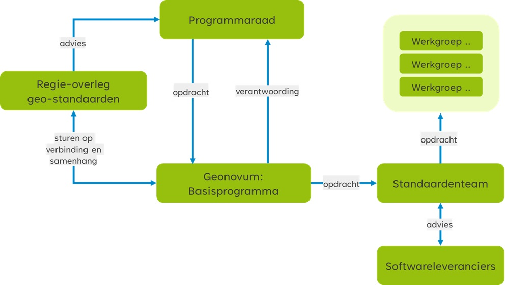

# Wijzigingsproces {#60D731F6}
De basis onder ons standaardisatiewerk is het afstemmen van deze standaarden met zowel internationale als nationale standaardisatie organisaties. Geonovum is lid van de internationale standaardisatie organisaties OGC en W3C en wij nemen actief deel aan verschillende werkgroepen. Geonovum levert de voorzitter van de NEN Normcommissie 351 240 voor Geo-informatie van waaruit we ook deelnemen in het Europese ISO. Het afstemwerk dat we in al deze organisaties doen, is gericht op het borgen van vindbaarheid, toegankelijkheid, uitwisselbaarheid en herbruikbaarheid van geodata onderling en met andere databronnen. Bovendien kunnen we er zo voor zorgen dat de standaarden die we in Nederland toepassen, mee blijven bewegen met technologische innovaties en internationale ontwikkelingen.
 
 
De aanleiding voor een wijzigingsproces is gebaseerd op meldingen: de wensen en gevonden fouten in de geo-standaard, die aanleiding zijn om de standaard te vernieuwen. Samen vormen zij het wijzigingsvoorstel. Geonovum neemt als beheerder het initiatief om een wijzigingsproces te starten. Zie <a href='#d5e1126'>Figuur 2</a>.
## Fasen in het wijzigingsproces {#24999071}
Het volledige wijzigingsproces doorloopt de fasen Inhoud, Toetsing, Besluitvorming en Implementatie, zoals weergegeven in onderstaand figuur. 
 
 
<figure></img>
<figcaption>Fasen wijzigingsproces</figcaption></figure>

<b>Inhoud</b>
In de fase Inhoud wordt voor iedere melding bepaald of deze wordt opgenomen in de nieuwe versie van de standaard of niet. Dit wordt vastgelegd met behulp van GitHub of een andere issue tracker en is zichtbaar via de website van Geonovum. Voor meldingen die worden meegenomen in de nieuwe versie van de standaard, worden oplossingen uitgewerkt, op basis waarvan vervolgens de specificatie wordt aangepast. Dit gebeurt door Geonovum in samenwerking met inhoudelijke experts. Afhankelijk van de omvang van de wijziging ten opzichte van de voorgaande versie is de groep van experts evenredig groter of kleiner. 
 
 
<b>Toetsing</b>
De fase Toetsing vormt een brug tussen de inhoud, besluitvorming en de implementatie. In deze fase wordt eenieder (X, Y wijziging) of een beperkte groep belanghebbenden (Z wijziging) uitgenodigd om zijn visie te geven op de nieuwe versie van de standaard. De reacties uit de consultatie worden verwerkt in de specificatie. In het geval van een X of Y wijziging wordt de nieuw voorgestelde versie voorgelegd aan het Regie-overleg met het verzoek advies uit te brengen aan de Programmaraad van Geonovum (zie paragraaf 3.2). 
 
 
<b>Besluitvorming</b>
Bij Besluitvorming wordt besloten om de gewijzigde specificatie vast te stellen en te publiceren. Afhankelijk van het type wijziging en de betreffende geo-standaard (X, Y of Z, zie paragraaf <a href='https://docs.geostandaarden.nl/gsw/gsw/' target='_blank'>Proces varianten</a>, besluit de Programmaraad van Geonovum dan wel het standaardenteam van Geonovum. Eenmaal vastgesteld en gepubliceerd, wordt de nieuwe versie van de standaard door Geonovum aangemeld bij het <a href='https://forumstandaardisatie.nl/open-standaarden/verplicht?trefwoord=182' target='_blank'>Forum Standaardisatie</a>.
 
 
<b>Implementatie</b>
Het in gebruik nemen van de geo-standaard in de praktijk staat centraal in deze fase. Hiervoor leveren we verschillende technische bestanden op, zoals implementatiebestanden, voorbeeldbestanden en voorbeeldberichten. Deze bestanden ondersteunen softwareleveranciers en gebruikers van de geo-standaard bij de implementatie van de standaard in hun software. Beheerders van de voorziening/ het register e.d. nemen de geo-standaard over. Daarnaast stelt Geonovum validators beschikbaar, waarmee de technische juistheid van de implementatie van standaarden kan worden getoetst. Wij ondersteunen de implementatie bovendien door de werking van de geo-standaard toe te lichten op bijvoorbeeld een wiki. Resultaat van deze fase is dat de gebruikers data kunnen maken en uitwisselen conform de nieuwe standaard. In hoofdstuk <a href='https://docs.geostandaarden.nl/gsw/gsw/' target='_blank'>Implementatie</a> lichten we de implementatie verder toe.
## Inzicht in het wijzigingsproces {#21D2F6BA}
De meldingen en wijzigingsverzoeken alsook (inter)nationale ontwikkelingen geven aanleiding tot de verdere ontwikkeling voor een geo-standaard. Het wijzigingsproces doorloopt de fasen zoals geschetst in paragraaf 3.1. 
In figuur ‘Wijzigingen doorvoeren in de geo-standaarden’ is het proces voor X en Y wijzigingen weergegeven. Het standaardenteam kan 1 of meerdere werkgroepen samenstellen. De werkgroep onderzoekt de wijzigingsverzoeken en werkt aan een nieuwe versie van de geo-standaard door dit vast te leggen in een wijzigingsvoorstel. Het standaardenteam vraagt ook aan softwareleveranciers advies over de wijzigingsverzoeken en de wijze waarop deze in de nieuwe versie worden verwerkt. Na consultatie van het wijzigingsvoorstel (zie paragraaf 2.2.2) legt het standaardenteam het voorstel voor aan het Regie-overleg geo-standaarden. Op basis van het advies van het advies van het Regie-overleg geo-standaarden besluit de Programmaraad van Geonovum over het wijzigingsvoorstel. 
 
 
Bij het vaststellen van een nieuwe versie van een standaard stelt de Programmaraad met advies van Geonovum vast hoelang een oude versie van de geo-standaard wordt ondersteund en wanneer een oude versie komt te vervallen. Een uitzondering hierop is het Basismodel Geo-informatie (NEN 3610). Ook nieuwe versies van deze standaard bereidt Geonovum voor in samenwerking met werkgroepen. De programmaraad stelt de nieuwe versie niet vast, maar keurt hem goed (of af) en draagt deze vervolgens voor aan de NEN normcommissie 351 240 Geo-informatie. Deze commissie verzorgt de openbare consultatie en stelt de standaard formeel vast. De Programmaraad beslist, op advies van Geonovum, of zij een vastgestelde standaard voordraagt voor opname op de ‘Pas toe of leg uit’ -standaarden lijst van het Forum Standaardisatie. Bij een positief besluit verzorgt Geonovum de voordracht bij het Forum Standaardisatie. Organisatorisch bestaat er geen formele relatie tussen de Programmaraad en het Forum Standaardisatie, inhoudelijk dus wel.
 
 
<figure></img>
<figcaption>Figuur 3 Wijzigingen doorvoeren in de geo-standaarden</figcaption></figure>

